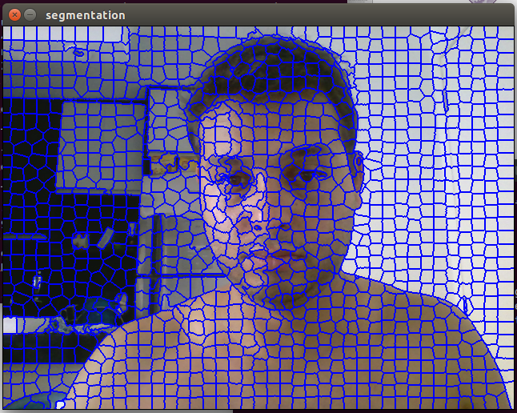

# Título: python-superpixel com CUDA
## Autor: Hemerson Pistori
## Autor: Alessandro dos Santos Ferreira
## Autor: Rodrigo Gonçalves de Branco
## Resumo:

Código em python que permite experimentar diferentes valores para os parâmetros do algoritmos de geração de superpixels SLIC e gerar um banco de imagens a partir de superpixels anotados. Também é possível gerar um arquivo ARFF, realizar um teste de desempenho de classificação e classificação automática das imagens com um classificador passado por parâmetro ( algoritmo J48 por padrão ).

Nesta variação, além do algoritmo SLIC da biblioteca Python scikit-image, é possível utilizar também uma implementação paralela em C++/CUDA (Ren et al.2015, disponível em https://github.com/carlren/gSLICr). No momento, o único parâmetro usado para a implementação CUDA é o número de segmentos.

## Como Usar

- Entre na pasta com o código fonte (que também é 'executável/interpretável' no caso do python)

  ```
  $ cd src
  ```
- Execute o código (o trecho a partir de --imagem é opção, se apenas chamar o programa sem passar nada como parâmetros irá usar uma imagem de teste que está na pasta data )
  
  ```
  $ python ./slicParametros.py --imagem caminho_para_imagem/nome_da_image
  ```

- Uma imagem como a mostrada abaixo deve ser apresentada:


  - Passo 1: Arraste as duas barras que aparecem na parte de baixo ou clique em outras partes da barra para mudar os valores dos parâmetros segmentos e sigma (aguarde um pouco para que a imagem seja atualizada)
  - Passo 2: Arraste a barra "Classe Atual" para indicar a qual classe os superpixels marcados devem ser associados. Este valor começa com a classe 1 
  - Passo 3: Clique em algum superpixel para indicar que este superpixel pertence à classe que está marcada na barra de rolagem (Classe Atual). Retorne ao passo 2 escolhendo outra classe e marcando mais superpixels até ter coletado o suficiente
  Este processo pode ser repetido em outras imagens para extrair mais superpixels para as mesmas classes (os superpixels vão sendo acumulados dentro das pastas e os antigos não são apagados)
  - Passo 4: Clique no botão Gerar Arff para:
    - Gerar um arquivo data.arff através do extrai-atributos usando todas as imagens acumuladas nas pastas
  - Passo 5: Clique no botão CrossVal para ( Tenha pelo menos 5 superpixels para 2 classes ):
    - Realizar uma validação cruzada e mostrar o resultado da avaliação e ROC
  - Passo 6: Clique no botão Classificar para ( Tenha pelo menos 5 superpixels para 2 classes ):
    - Realizar o treinamento e classificação automática
    
- Observe que nesta versão é apresentada a tomada de tempos de geração da máscara de segmentos.
- OBS: Nesta versão, o único parâmetro que traz modificações na execução para a implementação CUDA é a barra de "Segmentos" 

## Outras Opções

- Mostra todas as opções disponíveis

  ```
  $ python slicParametros.py --help
  ```
- Executa o programa abrindo a imagem *../data/digits.jpg* e inicializando o banco em *../data/digits*

  ```
  $ python slicParametros.py -i ../data/digits.jpg -b ../data/digits
  ```
- Executa o programa permitindo selecionar até 2000 segmentos e com as seguintes configurações: Segmentos - 20 Sigma - 5.00 Compactness - 32.00

  ```
  $ python slicParametros.py -mse 2000 -se 200 -si 5 -sc 32
  ```
- Executa o programa configurando como classificador padrão o AdaBoostM1 com 20 iterações no algoritmo RandomForest

  ```
  $ python slicParametros.py -c AdaBoostM1 -co "-I 20 -W weka.classifiers.trees.RandomForest"
  ```

## Branch submodule

O branch submodules possui várias opções adicionais como permitir a customização das classes a serem utilizadas.  
Além disso ele faz integração direta com o software python-extrai-atributos, sem replicação do código.

Para acessar o branch submodules devem ser executados os seguintes comandos:

- git pull origin
- git checkout submodules
- git submodule init
- git submodule update

## Dependências - Aplicação base - Python

### Linux
- kubuntu trusty 14.04.2 TLS
- Python 2.7.6 
- scikit-image
- Opencv 2.7
- python-weka-wrapper 0.3.5

### Windows

- Instale o [Anaconda](http://continuum.io/downloads) que contém todas dependências, inclusive o Python. Basta fazer o download do arquivo .exe e executá-lo.


## Como instalar o OpenCV 

### Linux
  Seguir as instruções disponíveis em [OpenCV-Linux](http://docs.opencv.org/doc/tutorials/introduction/linux_install/linux_install.html#linux-installation). Lí em algum lugar que dá para instalar com o comando abaixo, não testei mas pode funcionar:
  ```
  $ sudo apt-get install python-opencv
  ```

  Pode ser que seja necessário instalar também uma versão mais antiga do opencv (2.4*) caso apareça um erro com o comando import cv (que sumiu na versão 3.0.0 do opencv). Neste caso, tente seguir estes passos: [Instalando opencv 2.4] (https://sites.google.com/a/computacao.ufcg.edu.br/lvc/aprendizado/opencv).

### Windows
 - [OpenCV-Python](https://opencv-python-tutroals.readthedocs.org/en/latest/py_tutorials/py_setup/py_setup_in_windows/py_setup_in_windows.html#install-opencv-python-in-windows).
	1. Baixe o [Opencv](https://opencv-python-tutroals.readthedocs.org/en/latest/py_tutorials/py_setup/py_setup_in_windows/py_setup_in_windows.html#install-opencv-python-in-windows)
	2. Extraia os arquivos no local desejado.
	3. Vá para a pasta opencv/build/python/2.7.
	4. Cipie o arquivo cv2.pyd para C:/Python27/lib/site-packeges.
	5. Abra o terminal e digite python para executar o interpretador.
	6. Digite:
    	
      ```
        >>> import cv2
        >>> print cv2.__version__
      ```

## Como instalar scikit-image e arff
```
  $ sudo apt-get install python-numpy python-scipy python-matplotlib ipython ipython-notebook python-pandas python-sympy python-nose python-pip python-networkx libfreetype6-dev
 
  $ sudo pip install -U scikit-image
```

  Em uma das máquinas em que tentei instalar deu um erro que resolvi rodando o comando abaixo antes de executar a linha acima:
  ```
  $ sudo apt-get build-dep python-matplotlib
  $ sudo pip install cycler
  ```

## Como instalar o python-weka-wrapper

### Ubuntu 

    Primeiro você precisa compilar os código C/C+ e os módulos Python:
    $ sudo apt-get install build-essential python-dev
    
    Agora você pode instalar os vários pacotes que precisamos para instalar o python-weka-wrapper:
    $ sudo apt-get install python-pip python-numpy
    
    Os seguintes pacotes são opcionais mas necessários se você deseja uma representação gráfica:
    $ sudo apt-get install python-imaging python-matplotlib python-pygraphviz
    
    Instale OpenJDK para obter todos os cabeçalhos que javabridge compila:
    $ sudo apt-get install default-jdk

    No meu ubuntu 14.04 tive problemas com dependência, acabei instalando o java da oracle seguindo as orientações deste site: [instalando java da oracle](http://askubuntu.com/questions/521145/how-to-install-oracle-java-on-ubuntu-14-04)
    
    Finalmente você pode usar pip para instalar os pacotes Python que não estão disponíveis no repositório:
    $ sudo pip install javabridge
    $ sudo pip install python-weka-wrapper
    
### Windows

    Por favor note: você precisa certificar-se que os bits do seu ambiente é consistente. Isto é, se você instalar uma versão de Python 32-bit você deve instalar um JDK 32-bit e numpy 32-bit ( ou então todos eles devem ser 64-bit ).

    Realize os seguintes passos:

    Instale Python, esteja certo que você checou Add python.exe to path durante a instalação
    Adicione os scripts Python eu sua variável de ambiente PATH, por exemplo, :\\Python27\\Scripts
    Instale pip com os seguintes passos:
        * baixe daqui https://bootstrap.pypa.io/get-pip.py
        * instale usando python get-pip.py
    
    Instale numpy
        * baixe numpy 1.9.x MKL ( ou superior ) para Python 2.7 (cp27) e sua configuração de bit  (32 ou 64 bit)
        * instale o arquivo .whl usando pip: pip install numpy-X.Y.Z.whl
    
    Instale .Net 4.0 (se já não estiver instalado)

    Instale Windows SDK 7.1

    Abra o prompt de comando do Windows SDK (não o prompt de comando convencional!) e instale javabridge e python-weka-wrapper
        > set MSSdk=1
        > set DISTUTILS_USE_SDK=1
        > pip install javabridge
        > pip install python-weka-wrapper

    Agora você pode executar python-weka-wrapper usando o prompt de comando convencional também.

    Se você deseja as funcionalidades gráficas você precisa instalar matplotlib também:
        * baixe matplotlib para Python 2.7 (cp27) e sua configuração de bit (32 or 64 bit)
        * instale o arquivo .whl usando pip: pip install matplotlib-X.Y.Z.whl
    
## Mais informações

- http://pythonhosted.org/python-weka-wrapper/install.html
- http://pythonhosted.org/python-weka-wrapper/troubleshooting.html

## Dependências - C++/CUDA gSLICr ( Opcional )

IMPORTANTE: Caso você não deseje utilizar a integração com CUDA, os passos dessa seção não são necessários.

Além das dependências descritas anteriormente, com exceção do Sistema Operacional, o código funcional do módulo C++/CUDA gSLICr foi construído em uma máquina:

- Linux/Ubuntu 15.04 vivid LTS 64bits
- Cmake 3.0.2
- c++ 4.9.2
- Cuda 7.5 Toolkit
- Opencv 3.0
- Swig 2.0


### Como instalar o restante das dependências

- Primeiro, instale as dependências listadas para a aplicação base - Python. Depois instale as seguintes dependências com o comando apt-get:

  ```
  $ sudo apt-get install cmake libopencv-dev swig
  ```

- Para a instalação Cuda, é necessário seguir as instruções da página do desenvolvedor (https://developer.nvidia.com/cuda-toolkit). Caso esteja usando Linux/Ubuntu 15.04 vivid LTS, basta baixar a versão network do pacote (cuda-repo-ubuntu1504_7.5-18_amd64.deb), instalar com o comando:

  ```
  $ sudo dpkg -i cuda-repo-ubuntu1504_7.5-18_amd64.deb
  ```

- Depois, execute os comandos:

  ```
  $ sudo apt-get update
  $ sudo apt-get install cuda-7-5
  ```

- OBS: Possivelmente será necessário reiniciar o computador e configurar as variáveis de ambiente PATH e LD_LIBRARY_PATH, conforme recomendações da Nvidia.

- Você precisa ainda dos arquivos do projeto gSLICr (https://github.com/carlren/gSLICr). Em uma pasta de sua preferência (fortemente recomendado que seja uma pasta diferente do projeto atual python-superpixel), execute os seguintes comandos:

  ```
  $ git clone https://github.com/carlren/gSLICr.git
  ```

- Antes de qualquer ação, verifique qual é a arquitetura de sua placa CUDA. Este projeto considera por padrão placas com a arquitetura 3.0. A placa usada para os testes foi uma GT 720M, uma placa com arquitetura 2.0. Por isso, é necessário alterar, dentro da pasta gSLICr criada pelo git, o arquivo CMakeLists.txt nas linhas referentes ao comando cuda_add_library. Os parâmetros arch=compute_30 e code=compute_30 devem ser alterados se necessário. No caso testado, a alteração ficou da seguinte forma:

  ```
  cuda_add_library(gSLICr_lib
			${GSLICR_LIB}
			NVTimer.h
			OPTIONS -gencode arch=compute_20,code=compute_20)

  ```

- Depois, criaremos uma pasta de build dentro da pasta criada pelo git:

  ```
  $ cd gSLICr
  $ mkdir build
  $ cd build
  $ cmake ..
  $ make
  ```

- Se tudo ocorrer bem, além de outros, dois arquivos serão criados dentro da pasta build: libgSLICr_lib.a e demo. É uma boa oportunidade para testar a instalação CUDA, executando o comando:

  ```
  $ ./demo
  ```

- Uma imagem parecida com a abaixo deve aparecer:



### Instalação do Módulo C++ gSLICrInterface

- Navegue até a pasta do projeto python-superpixel:

  ```
  $ cd python-superpixel/src
  $ mkdir build
  $ cd build
  $ cmake -DGSLICR_HEADER_SRC=/full/path/to/gSLICr ..
  $ make
  ```

- Substitua o caminho /full/path/to/gSLICr para o caminho completo do projeto gSLICr em seu computador. Caso, por algum motivo, o arquivo libgSLICr_lib.a não esteja na pasta build dentro do projeto gSLICr, então é necessário definir também a variável -DGSLICR_LIB_FULL_PATH para indicar onde encontrar tal arquivo.

- Se tudo correu bem, a seguinte saída deve ter sido apresentada:

  ```
  $ [100%] Built target _gSLICrInterface
  ```
  
  - Se ainda estiver na pasta de construção do módulo, volte para a pasta src do projeto. O arquivo slicParametros.py tenta importar o módulo gSLICrInterface do subdiretório build por padrão. Se este não for o diretório onde o módulo gSLICrInterface foi construído, abra o arquivo slicParametros.py e altere o seguinte trecho:

  ```
  from build import gSLICrInterface
  ```

para 

  ```
  from <DIRETORIO_GSLICRINTERFACE> import gSLICrInterface
  ```

Se houver um erro na importação do módulo ou na utilização CUDA, o programa funcionará mas apresentará a seguinte mensagem:

  ```
  Há algum problema com a instalação do módulo gSLICrInterface ou do adaptador gráfico CUDA e portanto tal configuração não poderá ser usada.
  ```


## Como integrar com o python-extrai-atributos
  - Serão criadas uma pasta para cada classe dentro da pasta python-superpixel/data/demo
  - Dentro de cada pasta estarão os superpixels que foram marcados como sendo daquela classe
  - Crie uma nova pasta dentro de python-extrai-atributos/data e copie as pastas criadas pelo python-superpixel para lá
  - OPCIONAL: Renomear as pastas classe_01, classe_02, etc para que reflitam os nomes das classe no seu problema
  - Utilizar o python-extrai-atributos para gerar um arff para o novo banco de imagens
  - Utilizar o weka para experimentos com diferentes tipos de classificadores


## Desenvolvedor
Kleyton Leite (Desenvolvedor junior em  Python, JS fullstack);

## Fonte
Trabalho feito a partir de um fork do professor Emerson Pistori, vide /src/README.MD
